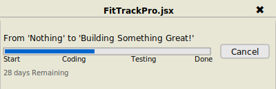

# FitTrackPro

**FitTrackPro** is a fitness and gym progress tracking application. It helps users keep track of their workouts, fitness goals, and progress over time.

## Features

- User registration and authentication (with JWT).
- Track workouts, exercises, and progress over time.
- Dashboard with visual progress reports.
- Integration with MongoDB for storing user data and progress.
- Responsive UI built with React.

## Testing the Application

To test the application, you can use the following login credentials:

**Login Credentials:**
- **Email:** `test@test.com`
- **Password:** `12345678`

Simply enter these details on the login page to access the application and explore its features.

## Technologies Used

### Frontend:
- React.js
- Axios
- React Router DOM
- Vite

### Backend:
- Node.js with Express.js
- MongoDB
- JWT for authentication
- bcrypt.js for password hashing

## Installation

### Prerequisites:
- Node.js
- MongoDB

### Clone the repository:
```bash
git clone https://github.com/alirezabandegi/FitTrackPro.git
cd FitTrackPro
```

### Backend Setup:
1. Navigate to the `backend` directory:
   ```bash
   cd backend
   ```
2. Install backend dependencies:
   ```bash
   npm install
   ```
3. Create a `.env` file in the `backend` directory and add the following environment variables:
   ```
   MONGODB_URI=your-mongodb-connection-string
   JWT_SECRET=your-jwt-secret
   ```
4. Start the backend server:
   ```bash
   npm run dev
   ```

### Frontend Setup:
1. Navigate to the `frontend` directory:
   ```bash
   cd frontend
   ```
2. Install frontend dependencies:
   ```bash
   npm install
   ```
3. Start the frontend development server:
   ```bash
   npm run dev
   ```

## Usage

1. After setting up the backend and frontend, open your browser and navigate to:
   ```
   http://localhost:3000
   ```
2. Register a new user account, log in, and start tracking your fitness journey.

## API Endpoints

- **POST** `/api/auth/signup`: Register a new user.
- **POST** `/api/auth/login`: User login.
- **POST** `/api/auth//logout`: User logout.
- **GET** `/api/auth/user`: Check if user logged in.
- **GET** `/api/auth/profile`: User informations.
- **GET** `/api/auth/progress`: Fetch user's workout progress.

## Project Progress



## License

This project is licensed under the MIT License - see the [LICENSE](LICENSE) file for details.

## Contributing

Feel free to submit issues and pull requests! For major changes, please open an issue first to discuss what you would like to change.

## Contact

**Author**: Alireza Bandegi  
GitHub: [alirezabandegi](https://github.com/alirezabandegi)